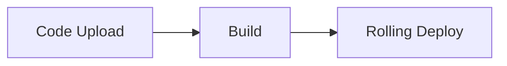

LiveKit docs › Manage & Deploy › Agent deployment › Deployment management

---

# Deployment management

> Configure, deploy, and manage your agent deployments using the LiveKit CLI.

## Overview

Use the LiveKit CLI to configure, deploy, and manage your agent deployments. This guide covers deployment configuration, deploying new versions, rolling back, and understanding cold starts.

## Configuration

The `livekit.toml` file contains your agent's deployment configuration. The CLI automatically looks for this file in the current directory, and uses it when any `lk agent` commands are run in that directory.

** Filename: `livekit.toml`**

```toml
[project]
  subdomain = "<my-project-subdomain>"

[agent]
  id = "<agent-id>"

```

To generate a new `livekit.toml` file, run:

```shell
lk agent config

```

## Deploying new versions

To deploy a new version of your agent, run the following command:

```shell
lk agent deploy

```

LiveKit Cloud builds a container image that includes your agent code. The new version is pushed to production using a rolling deployment strategy. The rolling deployment allows new instances to serve new sessions, while existing instances are given up to 1 hour to complete active sessions. This ensures your new version is deployed without user interruptions or service downtime.



When you run `lk agent deploy`, LiveKit Cloud follows this process:

1. **Build**: The CLI uploads your code and builds a container image from your Dockerfile. See [Builds and Dockerfiles](https://docs.livekit.io/deploy/agents/builds.md) for more information.
2. **Deploy**: New agent instances with your updated code are deployed alongside existing instances.
3. **Route new sessions**: New agent requests are routed to new instances once they're considered [healthy](#health-checks).
4. **Graceful shutdown**: Old instances stop accepting new sessions, while remaining active for up to 1 hour to complete any active sessions.
5. **Autoscale**: New instances are automatically scaled up and down to meet demand.

### Health checks

LiveKit Cloud only removes old agent instances after the new agent's [health check endpoint](https://docs.livekit.io/agents/server/options.md#health-check) starts passing. This ensures that if the new agent doesn't start correctly or starts slowly, the old agent instances can still serve new traffic.

LiveKit Cloud allows 5 minutes for the health check to start passing for a new agent instance. If you're not seeing requests routed to the new agent version, make sure the `prewarm` function doesn't take longer than 5 minutes to complete.

## Deploy with GitHub Actions

To deploy from CI instead of running `lk agent deploy` by hand, use the [`livekit/deploy-action`](https://github.com/livekit/deploy-action) GitHub Action. Use it to deploy your agent whenever code is pushed to your main branch.

1. Add the following secrets to your GitHub repository (navigate to **Settings** → **Secrets and variables** → **Actions**):

| Secret | Description |
| `LIVEKIT_URL` | Your LiveKit Cloud URL, for example `wss://your-project.livekit.cloud`. |
| `LIVEKIT_API_KEY` | Your LiveKit Cloud API key. |
| `LIVEKIT_API_SECRET` | Your LiveKit Cloud API secret. |
| `SECRET_LIST` | Comma-separated agent secrets, for example `OPENAI_API_KEY=sk-xxx,AUTH_TOKEN=abc123`. |

1. Add a workflow file at `.github/workflows/deploy.yml` that deploys on push.

The follow example deploys your agent whenever code is pushed to your main branch in the `voice-agent` directory:

```yaml
name: Deploy agent
on:
  push:
    branches:
      - main
    paths:
      - 'voice-agent/**'

jobs:
  deploy:
    runs-on: ubuntu-latest
    concurrency:
      group: deploy-${{ github.ref_name }}
      cancel-in-progress: true

    steps:
      - uses: actions/checkout@v4

      - name: Deploy LiveKit Cloud agent
        uses: livekit/deploy-action@v2
        env:
          LIVEKIT_URL: ${{ secrets.LIVEKIT_URL }}
          LIVEKIT_API_KEY: ${{ secrets.LIVEKIT_API_KEY }}
          LIVEKIT_API_SECRET: ${{ secrets.LIVEKIT_API_SECRET }}
          SECRET_LIST: ${{ secrets.SECRET_LIST }}
        with:
          OPERATION: deploy
          WORKING_DIRECTORY: voice-agent

```

To require manual approval before a deploy, run the job under a [GitHub environment](https://docs.github.com/en/actions/deployment/targeting-different-environments/using-environments-for-deployment) with required reviewers.

#### Action inputs

The GitHub action accepts the following inputs, set under the `with` key:

| Input | Description | Required | Default |
| `OPERATION` | Operation to perform: `create`, `deploy`, `status`, `status-retry`. | Yes | `status` |
| `WORKING_DIRECTORY` | Directory containing the agent configuration. | No | `.` |
| `REGION` | Region to deploy to. Defaults to the nearest region. | No | `""` |
| `SLACK_TOKEN` | Slack bot token for deploy notifications. | No | `""` |
| `SLACK_CHANNEL` | Slack channel for notifications, for example `#general`. | No | `""` |
| `TIMEOUT` | Timeout for the `status-retry` operation. | No | `5m` |

## Rolling back

You can quickly rollback to a previous version of your agent, without a rebuild, by using the following command:

```shell
lk agent rollback

```

Rollback operates in the same rolling manner as a normal deployment.

> ℹ️ **Paid plan required**
> 
> Instant rollback is available only on paid LiveKit Cloud plans. Users on free plans should revert their code to an earlier version and then redeploy.

## Cold start

On the **Build (free) plan**, production agents can be scaled down to zero replicas after all active sessions end. When a new user connects, the instance does a "cold start" to serve them, which adds 10 to 20 seconds before the agent joins the room. On paid plans (Ship and Scale), production agents stay warm. For more info, see the [Quotas and limits](https://docs.livekit.io/deploy/admin/quotas-and-limits.md#agent-cold-starts) guide.

[Non-production deployments](https://docs.livekit.io/deploy/agents/deployments.md) always scale to zero when idle, on every plan, and cold-start on the next request.

---

This document was rendered at 2026-08-19T12:45:12.219Z.
For the latest version of this document, see [https://docs.livekit.io/deploy/agents/managing-deployments.md](https://docs.livekit.io/deploy/agents/managing-deployments.md).

To explore all LiveKit documentation, see [llms.txt](https://docs.livekit.io/llms.txt).